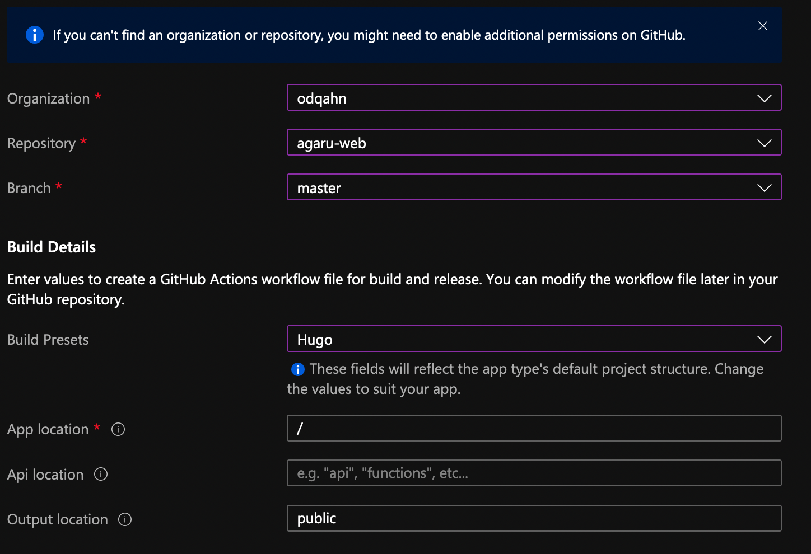

+++
title = "Hosting"
date = "2021-03-01"
description = "Hosting agaru"
+++

## Welcome

Here's a first post about this webiste.

## Intro

Tools:

- [Hugo](https://gohugo.io/)
- [Azure Statis Web Apps](https://azure.microsoft.com/fr-fr/services/app-service/static/)
- [Github](https://github.com)
- [VScode](https://code.visualstudio.com/)
- [Markdown](https://daringfireball.net/projects/markdown/)

Hugo is an open-source static site generators based on Markdown. It allows you to generate static pages that requieres very few resources to serve. There will be some html, some css and some JS, and that's pretty much it. This will garantee an easy to maintain and very responsive website.

## Hugo

Installation is pretty easy: [https://gohugo.io/getting-started/installing](https://gohugo.io/getting-started/installing)

Once done, simply generate a new website: `hugo new site newsite` and you're ready to go.

Now we'll add a theme from the [themes repo of HUGO](https://themes.gohugo.io/), simply follow the steps in the theme doc to install it and configure you're site.

You can preview your site using `hugo server -d` and browse your localhost.

Once it's ready, generate your site using `hugo`and push the files in your repo.

## Azure

For the hosting, you can use [git pages](https://pages.github.com/) but I wanted to try the new [Azure Static App Service](https://azure.microsoft.com/en-us/services/app-service/static/). Both options are free, for now.

Azure Static App Service will generate ssl certificate for you for free once you [add a custome domain](https://docs.microsoft.com/en-us/azure/static-web-apps/custom-domain).

Now, let's automate deployment with git actions!

## Git workflow & deploy

I don't want to copy the files on the static wep app each time, it's gonna be a pain. My code is on github and I'm using git actions to automate deployment. Instead of managing content in a CMS like it's done with Wordpress or Drupal, you'll have to generate content with HUGO and push the new files in the repo.

While creating my static web app, I'll just link it to my GitHub like this:

As you can see, HUGO is already in the preset, which makes things a breeze.

Now, Azure is gonna generate a yaml file in my repo, generate and configure the spn with the good rights and configure the git action for me.

Now, all you need to do is push a new version of you site generated with HUGO in your repo and voilà!
